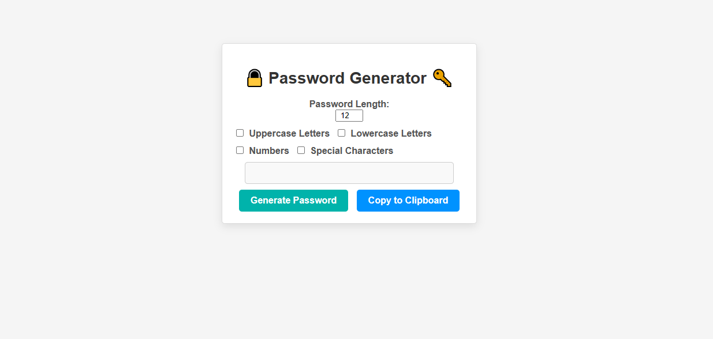

# Random Powerful Password Generator 

A simple web-based tool to generate strong and random passwords for your online accounts and security needs.

## Introduction

The Random Password Generator is a straightforward web application that allows you to create strong and secure passwords easily. With cyber threats on the rise, having a strong and unique password for each online account is crucial. This tool simplifies the process of generating complex passwords, enhancing your online security.

## Features

- Generate random, secure passwords with a single click.
- Customize password length to meet your specific requirements.
- Include or exclude various character types (uppercase, lowercase, numbers, special symbols) in your passwords.
- Copy generated passwords to your clipboard for easy use.

## License

This project is licensed under the MIT License. See the [LICENSE](LICENSE) file for details.

The MIT License is a permissive open-source license that allows you to use, modify, and distribute this software for both commercial and non-commercial purposes. You can find more information about the MIT License in the [LICENSE](LICENSE) file.

### Click on the image to view Demo >

